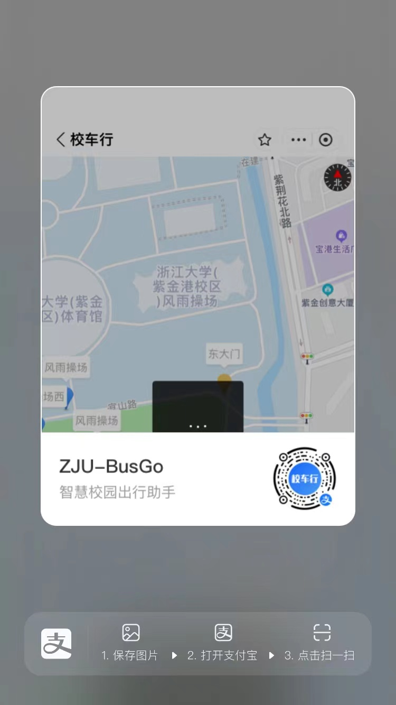
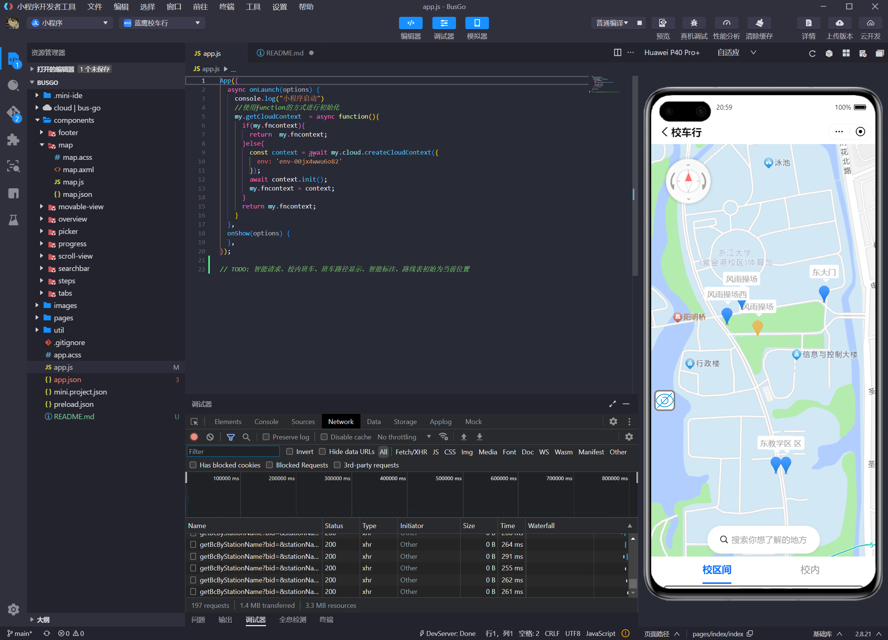

# 校车行

本产品面向在校师生，满足日常校区间和校内通勤的需求，用支付宝小程序开发框架，自主设计组件，使用了支付宝云开发服务，通过云函数、云数据库实现校车信息的管理等功能。师生可以通过小程序实时查询校车位置和时刻表，合理安排出行时间，减少等待时间，提高出行效率。与其他同类校车软件相比，本产品能够：1）通过校车时刻表和实时位置信息，用户可以实时获取校车位置、到站时间；2）可视化班车路线，为用户提供站点导航服务；3）支持班车换乘查询，缓存用户的查询记录；4）提供简洁直观友好的界面设计，方便用户快速上手。

小程序正参加支付宝竞赛，大家可以扫描下方图片中的二维码进行投票，感谢大家的支持！

## 启动方式

目前小程序已经在支付宝平台发布，可以直接使用。如果需要修改小程序的代码，可以通过专用的IDE启动。

### 支付宝小程序启动

支付宝搜索栏搜索“蓝鹰校车行”，或直接扫描下方二维码在支付宝中打开。

### 专用IDE启动

1. 下载[支付宝小程序开发者工具](https://opendocs.alipay.com/mini/ide/download)；
2. 打开IDE，选择“打开项目”，并选中本项目文件夹；
3. IDE会自动编译项目代码，最终的效果会在模拟器中显示。

## 关于 Issue 和 Contributing

如果发现小程序中的问题，可以依据模板填写Issue，注意写明现象和复现步骤。Issue将会很快得到回复。

欢迎任何致力于提升学校校车服务或对前端感兴趣的小伙伴的加入，包括且不限于提出需求、完善文档、参与讨论、答疑、修复Bug，提交特性等。后续小程序的代码将会被更加规整地重构和完善，届时欢迎提交PR。