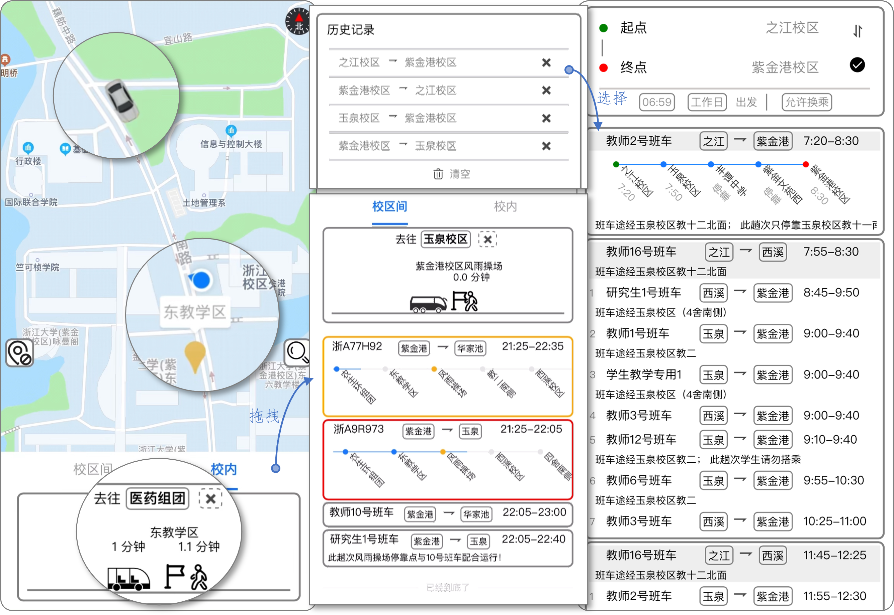

# 校车行

本产品面向在校师生，满足日常校区间和校内通勤的需求，用支付宝小程序开发框架，自主设计组件，使用了支付宝云开发服务，通过云函数、云数据库实现校车信息的管理等功能。师生可以通过小程序实时查询校车信息和时刻表，合理安排出行时间，减少等待时间，提高出行效率。

与其他同类校车软件相比，本产品能够：1）通过校车时刻表和实时位置信息，用户可以实时获取校车位置、到站时间，换乘查询班次；2）可视化班车路线，为用户提供站点导航服务；3）缓存用户的实时查询和时刻表查询的记录；4）提供简洁直观友好的界面设计与交互，方便用户快速上手。



## 启动方式

目前小程序已经在支付宝平台发布，可以直接使用。如果需要修改小程序的代码，请先使用`npm i`命令安装本项目的第三方库，然后可以通过`专用的 IDE`或`VSCode + IDE Lite 模式`启动。

### 支付宝小程序启动

支付宝搜索栏搜索“蓝鹰校车行”打开。

### 专用 IDE 启动

1. 下载[支付宝小程序开发者工具](https://opendocs.alipay.com/mini/ide/download)；
2. 打开IDE，选择“打开项目”，并选中本项目文件夹；
3. IDE会自动编译项目代码，最终的效果会在模拟器中显示。

### VSCode + IDE Lite 启动

1. 将IDE切换为Lite模式；
2. 用VSCode打开项目文件夹。

## 关于 Issue 和 Contributing

如果发现小程序中的问题，可以依据模板填写Issue，注意写明现象和复现步骤。Issue将会很快得到回复。

欢迎任何致力于提升学校校车服务或对前端感兴趣的小伙伴的加入，包括且不限于提出需求、完善文档、参与讨论、答疑、修复Bug，提交特性等。

## 项目目录

本项目的主要目录如下，页面保存于`pages`目录，组件保存于`components`目录。

```
BusGo
├─beans 实体类
├─cloud
│  └─functions 云函数
│      ├─queryBusLines 换乘查询
│      └─queryBusLinesByAddresses 已废弃
├─components 组件
│  ├─run-info
│  │  ├─campus-locate 校区定位
│  │  ├─map 地图
│  │  ├─movable-view 移动视图
│  │  ├─overview 概览视图
│  │  ├─overview-body
│  │  ├─overview-header
│  │  └─tabs 标签
│  ├─shared
│  │  ├─footer 底部提示
│  │  └─steps 班车到站
│  └─time-table
│      ├─place-picker 地点选择
│      ├─query-history 历史记录
│      └─query-result 查询结果
├─doc-images 文档图片
├─images 项目图片
├─options 设置
│  ├─apis 接口调用
│  └─props 组件参数
│      ├─run-info
│      └─time-table
├─pages 项目页面
│  ├─index 引导
│  ├─run-info 实时班车
│  └─time-table 时刻表
└─util 工具
   ├─cache.js 数据缓存
   ├─client.js 数据设置
   ├─formatter.js 数据格式化
   ├─notification.js 消息提示
   └─setters.js 数据处理
```